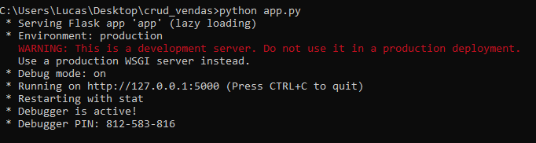

# crud_vendas

-Clone o repositório.

-Crie um ambiente virtual python e execute "pip install -r requirements.txt".

-Depois execute na pasta raiz do projeto "python app.py", e acesse o link Running on.

